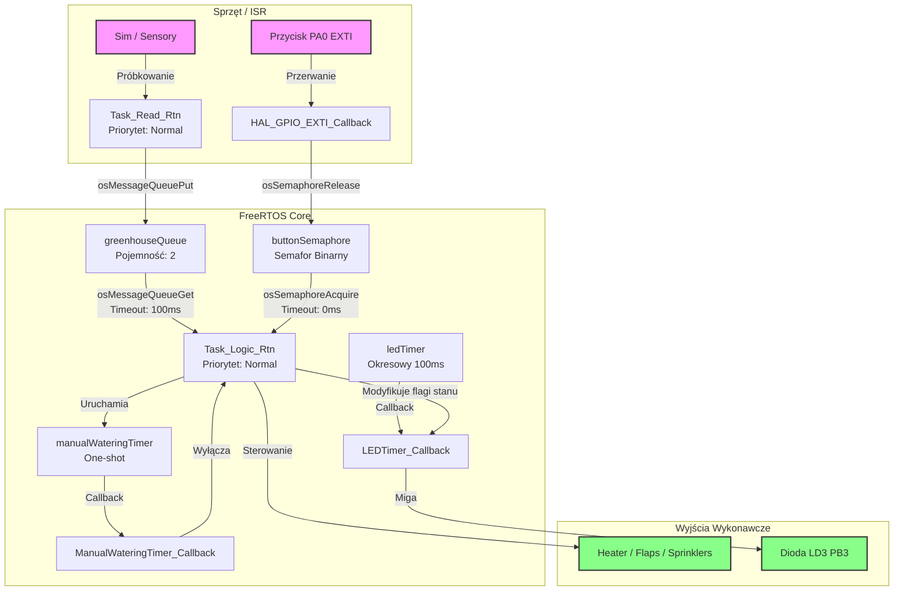

# 📑 Sterownik Szklarni — System Kontroli Mikroklimatu (FreeRTOS)

Sterownik szklarni to system wbudowany oparty na mikrokontrolerze **STM32F031K6** (rdzeń ARM Cortex-M0) pracujący pod kontrolą systemu czasu rzeczywistego **FreeRTOS (CMSIS-RTOS V2)**. System monitoruje parametry środowiskowe (temperatura z 3 czujników, wilgotność gleby/powietrza) i zarządza elementami wykonawczymi: piecem (ogrzewanie), klapami wentylacyjnymi (wietrzenie) oraz zraszaczami (podlewanie automatyczne i manualne).

Projekt został zoptymalizowany pod kątem ekstremalnie małych zasobów sprzętowych mikrokontrolera (32 KB FLASH, 4 KB RAM) przy zachowaniu standardów STM32Cube.

---

## 📌 CZĘŚĆ I: Instrukcja Użytkowa i Uruchomieniowa

### 🔌 Wymagania SprzętoweP i Połączenia
Do uruchomienia projektu wymagana jest płytka deweloperska **NUCLEO-F031K6**.
*   **Komunikacja UART**: Wbudowany programator ST-LINK przekierowuje port USART1 na wirtualny port szeregowy (VCP) komputera poprzez kabel USB.
    *   **TX**: Pin `PA2`
    *   **RX**: Pin `PA15` (wymagany przy dwukierunkowej komunikacji)
*   **Przycisk Podlewania Ręcznego**: Pin `PA0`. Posiada włączony wewnętrzny rezystor podciągający (Pull-Up).
    *   *Jak wywołać podlewanie bez fizycznego przycisku?* Przyłóż przewód połączony z pinem **PA0** do dowolnego pinu **GND** na płytce Nucleo (wywołanie zbocza opadającego na linii EXTI0).
*   **Dioda Statusowa (LD3)**: Pin `PB3` (zielona dioda wbudowana na płytce NUCLEO).

### 🚀 Budowanie i Wgrywanie Programu
Projekt można bez przeszkód kompilować i debugować zarówno w **VS Code** (CMake + Ninja + GCC toolchain), jak i w **STM32CubeIDE**.

#### Budowanie projektu w VS Code:
1. Kliknij na pasek stanu i wybierz konfigurację `Debug`.
2. Uruchom budowanie za pomocą CMake (skrót `F7` lub przycisk *Build*).

#### Wgrywanie firmware za pomocą OpenOCD (PowerShell):
```powershell
& "C:\Users\Julek\AppData\Roaming\xPacks\@xpack-dev-tools\openocd\0.12.0-7.1\.content\bin\openocd.exe" -f board/st_nucleo_f0.cfg -c "program build/Debug/STM_freertos_szklarania.elf verify reset exit"
```

### 💻 Monitorowanie Pracy (Serial Monitor)
Aby zobaczyć logi diagnostyczne, podłącz terminal szeregowy (np. wbudowany Serial Monitor w VS Code, Putty lub Hercules) do portu COM przypisanego do płytki ST-LINK.
*   **Baud Rate**: `38400`
*   **Data Bits**: `8`
*   **Parity**: `None`
*   **Stop Bits**: `1`
*   **Flow Control**: `None`

#### Co pojawia się na ekranie?
Po uruchomieniu układ przeprowadza autodiagnostykę obiektów systemu operacyjnego (tzw. *Boot Check*), po czym uruchamia symulację krok po kroku:

```text
--- BOOT CHECK ---
[OK] uartMutex is created
[OK] buttonSemaphore is created
[OK] manualWateringTimer is created
[OK] ledTimer is created
[OK] greenhouseQueue is created
[OK] defaultTask is created
[OK] readTask is created
--- END BOOT CHECK ---

DBG: readTask started
S:1 T1:10.0 T2:10.0 T3:25.0 H:55.0 B:0
DBG: defaultTask started
T:10.0,10.0,25.0 H:55.0
S:2 T1:10.0 T2:10.0 T3:25.0 H:55.0 B:0
T:10.0,10.0,25.0 H:55.0
...
```

*   **`S:N`**: Numer kroku symulacji środowiskowej.
*   **`T1`, `T2`, `T3`**: Temperatury z czujników (°C).
*   **`H`**: Wilgotność (%).
*   **`B`**: Aktualny stan wejściowy symulowanego przycisku (1 = wciśnięty).
*   **`T:x,y,z H:h`**: Wartości odebrane i przetworzone przez algorytm logiczny zadania głównego.
*   **Logi zdarzeniowe**:
    *   `SYSTEM: ...` — zdarzenia automatyczne (np. `SYSTEM: Humidity <40%. Sprinklers ON.`).
    *   `ALARM: ...` — stany alarmowe wymagające natychmiastowej reakcji (np. `ALARM: Critical temp! Heater ON!`).
    *   `USER: ...` — reakcja na wejście użytkownika (np. `USER: Manual button interrupt detected.`).
    *   `>>> ACTUATOR: ...` — bezpośrednie wysterowanie fizycznego wyjścia (np. `>>> ACTUATOR: Heater ON`).

### 🚨 Zachowanie Diody Statusowej (LD3)
Dioda zielona na płytce (`PB3`) sygnalizuje aktualny stan pracy urządzeń wykonawczych bez konieczności patrzenia w monitor szeregowy:

| Stan Pracy Szklarni | Sposób Świecenia LED | Opis Techniczny |
| :--- | :--- | :--- |
| **Podlewanie Aktywne** (AUTO lub Ręczne) | **Światło ciągłe (Solid ON)** | Najwyższy priorytet sygnalizacji. |
| **Ogrzewanie Aktywne** (Heater ON) | **Szybkie miganie (5 Hz)** | Cykl: 100ms włączona / 100ms wyłączona. |
| **Klapy Otwarte** (Flaps OPEN) | **Wolne miganie (1 Hz)** | Cykl: 500ms włączona / 500ms wyłączona. |
| **Tryb Czuwania** (Idle / Wszystko OFF) | **Krótki impuls (błysk)** | Mignięcie na 100ms raz na 2 sekundy (sygnał życia systemu). |
| **Błąd Krytyczny** (HardFault) | **Ekstremalnie szybkie miganie (~10 Hz)** | Pętla awaryjna CPU. System RTOS został zatrzymany. |

---

## 🛠️ CZĘŚĆ II: Szczegóły Techniczne dla Inżynierów

### 📐 Architektura Systemu i Przepływ Danych
Projekt opiera się na architekturze wielozadaniowej z podziałem odpowiedzialności (Separation of Concerns). Przepływ danych przedstawia poniższy diagram:



#### Komponenty i zadania systemu RTOS:
1.  **Zadanie Odczytu (`readTask`)**:
    *   Wykonywane przez funkcję `Task_Read_Rtn` w [greenhouse_logic.c](file:///c:/Users/Julek/Documents/STM_zajecia/Szklarnia/STM_freertos_szklarania/Core/Src/greenhouse_logic.c#L87).
    *   Pobiera dane pomiarowe z sensorów (w środowisku testowym generowane przez symulator kroków [greenhouse_hal_wrapper.c](file:///c:/Users/Julek/Documents/STM_zajecia/Szklarnia/STM_freertos_szklarania/Core/Src/greenhouse_hal_wrapper.c#L160)).
    *   Wysyła strukturę danych `Greenhouse_Sensors_t` do kolejki `greenhouseQueueHandle`.
    *   Zasypia na określony czas próbkowania.
2.  **Zadanie Logiki (`defaultTask` / `Task_Logic_Rtn`)**:
    *   Zaimplementowane w [greenhouse_logic.c](file:///c:/Users/Julek/Documents/STM_zajecia/Szklarnia/STM_freertos_szklarania/Core/Src/greenhouse_logic.c#L120). W celu zaoszczędzenia RAM-u, funkcja logiki została podpięta bezpośrednio pod domyślne zadanie generowane przez CubeMX (`defaultTask`), eliminując narzut na dodatkowy stos.
    *   Odpytuje kolejkę z timeoutem 100 ms. Po odebraniu danych dokonuje ewaluacji reguł sterowania.
    *   W tej samej pętli odpytuje semafor przycisku `buttonSemaphoreHandle` z zerowym czasem oczekiwania (non-blocking). Pozwala to na asynchroniczną reakcję na przerwania przycisku bez konieczności tworzenia osobnego zadania wątku dla obsługi użytkownika.
3.  **Kolejka Pomiarowa (`greenhouseQueue`)**:
    *   Kolejka komunikatów przechowująca obiekty typu `Greenhouse_Sensors_t` (rozmiar elementu: 8 bajtów). Długość kolejki została zredukowana do 2 elementów, co minimalizuje zapotrzebowanie na RAM.
4.  **Timer Podlewania Ręcznego (`manualWateringTimer`)**:
    *   Timer programowy typu *one-shot*. Uruchamiany po wykryciu wciśnięcia przycisku. Po upływie zdefiniowanego czasu jego callback resetuje flagę podlewania ręcznego i wyłącza zraszacze.
5.  **Timer Kontrolera LED (`ledTimer`)**:
    *   Timer programowy wywoływany okresowo co 100 ms. Odpowiada za generowanie odpowiednich sekwencji migania diody LD3 w zależności od globalnego stanu urządzeń wykonawczych.

---

### 💾 Analiza Zużycia Pamięci (RAM & FLASH)
Mikrokontroler STM32F031K6 charakteryzuje się bardzo małą przestrzenią pamięci: **32 KB FLASH** oraz **4 KB (4096 B) RAM**. Wymusiło to rygorystyczne podejście do optymalizacji kodu.

#### Statystyki kompilacji (Wersja Debug, GCC 15.2.1):
*   **FLASH**: **93.52%** (30644 / 32768 bajtów) — wolne: 2124 bajtów.
*   **RAM (SRAM)**: **84.96%** (3480 / 4096 bajtów) — wolne: 616 bajtów.

> [!WARNING]
> Wskaźnik RAM na poziomie ~85% reprezentuje alokację statyczną (zmienne globalne, bufory oraz sterty zadań RTOS zadeklarowane statycznie). Pozostałe 15% (616 bajtów) to margines bezpieczeństwa przeznaczony na stos główny procesora (MSP) obsługujący przerwania (ISR) oraz ramki stosu funkcji systemowych. Dalsze zwiększanie rozmiarów stosów zadań doprowadzi do przepełnienia pamięci RAM przy linkowaniu!

#### Tabela Alokacji Zasobów FreeRTOS (Wszystkie alokowane statycznie):
Wszystkie zasoby systemowe zostały zadeklarowane jako **statyczne** (z wyłączoną dynamiczną stertą systemową `pvPortMalloc` — rozmiar sterty `configTOTAL_HEAP_SIZE` wynosi zaledwie 64 bajty, co jest wymagane jako minimum dla poprawnej inicjalizacji warstwy CMSIS-RTOS V2).

| Nazwa obiektu | Typ zasobu | Stos (Słowa 32-bit) | Stos (Bajty) | Rozmiar TCB / Control Block | Łączny koszt RAM |
| :--- | :--- | :--- | :--- | :--- | :--- |
| **`readTask`** | Wątek | 48 | 192 B | 84 B (`StaticTask_t`) | **276 B** |
| **`defaultTask`** | Wątek (Logika) | 100 | 400 B | 84 B (`StaticTask_t`) | **484 B** |
| **`Tmr Svc`** (RTOS Timers) | Wątek systemowy | 128 | 512 B | 84 B (`StaticTask_t`) | **596 B** |
| **`Idle Task`** | Wątek systemowy | 80 | 320 B | 84 B (`StaticTask_t`) | **404 B** |
| **`greenhouseQueue`** | Kolejka komunikatów | — | 16 B (2x8B) | 76 B (`StaticQueue_t`) | **92 B** |
| **`uartMutex`** | Mutex | — | — | 76 B (`StaticSemaphore_t`) | **76 B** |
| **`buttonSemaphore`** | Semafor binarny | — | — | 76 B (`StaticSemaphore_t`) | **76 B** |
| **`manualWateringTimer`** | Timer programowy | — | — | 36 B (`StaticTimer_t`) | **36 B** |
| **`ledTimer`** | Timer programowy | — | — | 36 B (`StaticTimer_t`) | **36 B** |

---

### ⚙️ Parametryzacja Systemu (Gdzie Dokonać Zmian)

Modyfikacji zachowania sterownika można dokonać poprzez edycję odpowiednich makr konfiguracyjnych w plikach źródłowych:

1.  **Czas próbkowania czujników**:
    *   Plik: [greenhouse_logic.h](file:///c:/Users/Julek/Documents/STM_zajecia/Szklarnia/STM_freertos_szklarania/Core/Inc/greenhouse_logic.h#L27)
    *   Makro: `#define GREENHOUSE_READ_INTERVAL_MS 1000`
    *   *Uwaga*: Domyślnie ustawione na 1000 ms (1 sekunda) dla celów demonstracyjnych i przyspieszenia testowania czasów opóźnień. W wersji produkcyjnej należy zmienić tę wartość na **60000** (60 sekund).
2.  **Czas trwania podlewania ręcznego**:
    *   Plik: [greenhouse_logic.c](file:///c:/Users/Julek/Documents/STM_zajecia/Szklarnia/STM_freertos_szklarania/Core/Src/greenhouse_logic.c#L27)
    *   Makro: `#define MANUAL_WATERING_DURATION_MS (10 * 1000)`
    *   *Uwaga*: Ustawione na 10 000 ms (10 sekund) dla szybkiego testu wygasania timera. W wersji produkcyjnej należy zmienić na **600000** (10 minut / 600 sekund).
3.  **Progi temperatury ogrzewania**:
    *   Plik: [greenhouse_logic.c](file:///c:/Users/Julek/Documents/STM_zajecia/Szklarnia/STM_freertos_szklarania/Core/Src/greenhouse_logic.c#L148-L183)
    *   **Temperatura krytyczna (natychmiastowy start)**: `data.temp1 <= 10` (1.0°C) lub średnia temperatura `avg_temp <= 50` (5.0°C).
    *   **Standardowa temperatura załączenia**: `data.temp1 < 40` (4.0°C) utrzymująca się przez co najmniej 5 cykli próbkowania pomiarów pomnożonych przez interwał (czyli 5 * 1s = 5 sekund w teście, w produkcji: 5 * 1 min = 5 minut).
    *   **Temperatura wyłączenia (histereza)**: `data.temp1 >= 60` (6.0°C).
4.  **Progi temperatury otwarcia klap**:
    *   Plik: [greenhouse_logic.c](file:///c:/Users/Julek/Documents/STM_zajecia/Szklarnia/STM_freertos_szklarania/Core/Src/greenhouse_logic.c#L188-L214)
    *   **Temperatura otwarcia**: `data.temp3 > 280` (28.0°C) utrzymująca się przez 10 cykli próbkowania (10 sekund w teście, 10 minut w produkcji).
    *   **Temperatura zamknięcia (histereza)**: `data.temp3 <= 240` (24.0°C) — reakcja natychmiastowa.
5.  **Progi automatycznego podlewania (zraszaczy)**:
    *   Plik: [greenhouse_logic.c](file:///c:/Users/Julek/Documents/STM_zajecia/Szklarnia/STM_freertos_szklarania/Core/Src/greenhouse_logic.c#L217-L234)
    *   **Wilgotność start**: `data.humidity < 400` (40.0%).
    *   **Wilgotność stop (histereza)**: `data.humidity >= 600` (60.0%).
6.  **Konfiguracja Prędkości UART**:
    *   Plik: [usart.c](file:///c:/Users/Julek/Documents/STM_zajecia/Szklarnia/STM_freertos_szklarania/Core/Src/usart.c#L42)
    *   Linia: `huart1.Init.BaudRate = 38400;`
    *   *Uwaga*: Prędkość została zredukowana z 115200 do **38400** bps w celu zapewnienia wyższej stabilności przesyłu danych oraz zmniejszenia podatności na błędy transmisji przy długich liniach połączeniowych.

---

### 🛡️ Zaimplementowane Metody Optymalizacji i Bezpieczeństwa

#### 1. Całkowita eliminacja `snprintf` oraz obliczeń zmiennoprzecinkowych (`float`/`double`)
Standardowa biblioteka `printf`/`sprintf`/`snprintf` w implementacji GCC ARM (Newlib-nano) posiada ogromny narzut pamięciowy. Każde jej wywołanie wciąga do pamięci FLASH około **3-4 KB** kodu i rezerwuje na stosie zadania wywołującego **200-300 bajtów** pamięci RAM na buforowanie. Na mikrokontrolerze z 4 KB RAM-u spowodowałoby to niechybne przepełnienie stosu (Stack Overflow) i błąd *HardFault*.

**Rozwiązanie:**
*   Dane z czujników są przetwarzane i przesyłane w reprezentacji stałoprzecinkowej o mnożniku `x10` (typ `int16_t` / `uint16_t`).
*   W plikach [greenhouse_hal_wrapper.c](file:///c:/Users/Julek/Documents/STM_zajecia/Szklarnia/STM_freertos_szklarania/Core/Src/greenhouse_hal_wrapper.c) oraz [greenhouse_logic.c](file:///c:/Users/Julek/Documents/STM_zajecia/Szklarnia/STM_freertos_szklarania/Core/Src/greenhouse_logic.c) zaimplementowano dedykowane, bezbuforowe funkcje konwersji liczb na tekst:
    *   `u32_to_str()`: konwersja liczb bez znaku.
    *   `fixed_to_str()`: ręczne wstawianie kropki dziesiętnej dla wartości typu `X.Y`.
    *   `append_fixed()`: funkcja łącząca łańcuchy znaków bezpośrednio w dedykowanych buforach statycznych (poza stosem).

#### 2. Dedykowana pętla obsługi HardFault (Bare-Metal Debugging)
W przypadku wystąpienia błędu krytycznego procesora (np. naruszenie pamięci, próba wykonania niepoprawnej instrukcji), standardowa pętla obsługi błędów CubeMX wprowadza procesor w nieskończoną pustą pętlę, co nie daje inżynierowi żadnej informacji wizualnej.

**Rozwiązanie:**
W pliku [stm32f0xx_it.c](file:///c:/Users/Julek/Documents/STM_zajecia/Szklarnia/STM_freertos_szklarania/Core/Src/stm32f0xx_it.c#L79-L98) nadpisano `HardFault_Handler`:
```c
void HardFault_Handler(void)
{
  /* Bare-metalowy kod migania diodą PB3 (LD3) z pełną prędkością */
  while (1)
  {
    GPIOB->BSRR = GPIO_PIN_3; /* Włącz LED */
    for (volatile uint32_t i = 0; i < 80000; i++);
    GPIOB->BRR = GPIO_PIN_3;  /* Wyłącz LED */
    for (volatile uint32_t i = 0; i < 80000; i++);
  }
}
```
Miganie realizowane jest w sposób sprzętowy (bezpośredni zapis do rejestrów BSRR i BRR), bez polegania na funkcjach HAL czy RTOS, które w momencie awarii jądra mogą być już zablokowane. Miganie z częstotliwością ok. 10 Hz jednoznacznie informuje o awarii oprogramowania.

---

### 📈 Scenariusz Testowy i Fazy Symulacji
Aby umożliwić przetestowanie algorytmów bez podłączania rzeczywistych czujników fizycznych, system posiada wbudowany generator scenariuszy środowiskowych w [greenhouse_hal_wrapper.c](file:///c:/Users/Julek/Documents/STM_zajecia/Szklarnia/STM_freertos_szklarania/Core/Src/greenhouse_hal_wrapper.c#L160). Symulacja przebiega automatycznie według poniższego harmonogramu:

| Kroki (S) | Faza Symulacji | Oczekiwane Zachowanie Systemu |
| :--- | :--- | :--- |
| **1 – 10** | **Stan stabilny (Baseline)** | Temp1=10°C, Temp2=10°C, Temp3=25°C, H=55%. Wszystkie aktuatory wyłączone (OFF). Dioda LED błyska raz na 2s. |
| **11 – 20** | **Spadek temperatury Temp1** | Temp1 spada o 0.6°C na każdy krok, osiągając ostatecznie stabilną wartość 3.8°C. |
| **21 – 80** | **Czasowa weryfikacja ogrzewania** | Temp1 utrzymuje się na poziomie 3.8°C. Jako że Temp1 < 4.0°C, licznik cykli rośnie. Po 5 cyklach (krok **25**) piec włącza się (`Heater ON`). Dioda LED zaczyna migać szybko (5 Hz). |
| **81 – 90** | **Histereza ogrzewania (nagrzewanie)** | Temp1 rośnie o 0.8°C na krok. Przy przekroczeniu progu wyłączenia >= 6.0°C (krok **83**) piec wyłącza się (`Heater OFF`). |
| **91 – 93** | **Krytycznie niska temperatura Temp1** | Temp1 spada skokowo do 0.5°C. System natychmiast (w tym samym kroku!) włącza ogrzewanie (`Heater ON`), ignorując opóźnienie 5 cykli. |
| **94 – 100** | **Wygrzewanie po stanie alarmowym** | Temp1 wzrasta do 6.5°C. Ogrzewanie wyłącza się. |
| **101 – 105** | **Alarm niskiej średniej temperatury** | Temp1=6.0°C (powyżej progu załączenia), ale Temp2=4.0°C i Temp3=4.0°C. Średnia wynosi 4.6°C (<= 5.0°C). System natychmiast uruchamia ogrzewanie. |
| **106 – 120** | **Powrót do normy** | Wszystkie temperatury wracają do wartości stabilnych (10°C / 10°C / 25°C). Ogrzewanie wyłącza się. |
| **121 – 130** | **Wzrost temperatury Temp3** | Temp3 rośnie o 0.4°C na krok, osiągając 28.5°C. |
| **131 – 250** | **Czasowa weryfikacja otwarcia klap** | Temp3 utrzymuje się na poziomie 28.5°C (> 28.0°C). Po 10 cyklach (krok **140**) klapy wentylacyjne otwierają się (`Flaps OPEN`). Dioda LED miga wolno (1 Hz). |
| **251 – 260** | **Histereza klap (ochłodzenie)** | Temp3 spada skokowo do 23.5°C (<= 24.0°C). Klapy zamykają się natychmiast (`Flaps CLOSE`). |
| **261 – 270** | **Spadek wilgotności gleby (Susza)** | Wilgotność spada do 35.0% (< 40.0%). System automatycznie uruchamia zraszacze (`Sprinklers ON`). Dioda LED świeci światłem ciągłym. |
| **271 – 280** | **Nawadnianie automatyczne (Histereza)** | Wilgotność wzrasta do 62.0% (>= 60.0%). Zraszacze wyłączają się (`Sprinklers OFF`). Dioda LED wraca do błysków czuwania. |
| **283** | **Przycisk Podlewania Ręcznego** | Następuje wirtualne wciśnięcie przycisku na pinie `PA0` (przerwanie). Zraszacze włączają się (`Sprinklers ON`). Uruchamia się timer trwający 10 sekund (kroki 283-293). Po tym czasie podlewanie wyłącza się samoczynnie. |
